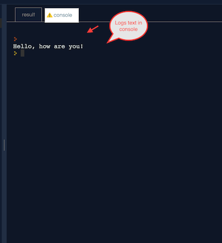

## Chapter 1
### javaScript - values - dataTypes - operators

## What is JavaScript?

The **JavaScript programming language** is used to write programs that run in web pages. JavaScript can control how a web page looks or make the page respond when a viewer clicks a button or moves the mouse. Sites like Gmail, Facebook, and Twitter use JavaScript to make it easier to send email, post comments, or browse websites. 

* JavaScript lets you play music and create amazing visual effects. For example, you can fly through an interactive music video created by HelloEnjoy for Ellie Goulding’s song “Lights(http://lights.helloenjoy.com/)
  
* JavaScript lets you build tools for others to make their own art. Patatap (http://www.patatap.com/) is a kind of virtual “drum machine” that creates all kinds of cool noises.

* JavaScript lets you play fun games. CubeSlam (https://www .cubeslam.com/) is a 3D re-creation of the classic game Pong, which looks a little like air hockey. You can play against one of your friends or a computer-generated bear


	

## Why learn JavaScript?
JavaScript is a great programming language to learn because it’s used everywhere. Web browsers like Chrome, Firefox, and Internet Explorer all use JavaScript. With the power of JavaScript, web programmers can transform web pages from simple documents into full-blown interactive applications and games.

## Writing Some JavaScript
### Console
The console is a tool that developers use to record the output of their JavaScript programs.The console.log() command is used to print, or log, text to the console. Consider the following example:
>console.log(‘Hello! Whats up!’)

## Variables
 JavaScript lets you give names to values using variables. To create a new variable, use the keyword var, followed by the name of the variable. A keyword is a word that has special meaning in JavaScript. 

 For example, here’s how you’d make a new variable called:

>var dog = ‘Posti’;

## Data 
Computer data is information processed or stored by a computer. This information may be in the form of text documents, images, audio clips, software programs, or other types of data. Computer data may be processed by the computer's CPU and is stored in files and folders on the computer's hard disk.

## Binary 
Binary (or base-2) a numeric system that only uses two digits — 0 and 1. Computers operate in binary, meaning they store data and perform calculations using only zeros and ones.

A single binary digit can only represent True (1) or False (0) in boolean logic.

Any integer can be represented in binary.

Examples:

>1 	1	20

>2	10	2

>3	11	21 + 20

>4	100	22

>5	101	22+ 20

>6	110	22 + 21

>7	111	22 + 21 + 20

>8	1000	23

>9	1001	23 + 20

One bit contains a single binary value — either a 0 or a 1. A byte contains eight bits, 

## Values 

Chunks that represents pieces of information.
  
## Datatypes 
#### Number- 
The number type represents both integer and floating point numbers.
Example- 
> 12, 13.4
> 
Besides regular numbers, there are so-called “special numeric values” which also belong to this data type:  **Infinity and NaN**
##### Infinity
It represents the mathematical Infinity ∞. It is a special value that’s greater than any number.
##### NaN 
It represents a computational error. It is a result of an incorrect or an undefined mathematical operation.

#### String 
Strings are used to represent text. They are written by enclosing their content in quotes.
Example- 
>'Down on the sea'

>'Lie on the ocean'

>'Float on the ocean'
   
#### Boolean
The boolean type has only two values: true and false.

This type is commonly used to store yes/no values: true means “yes, correct”, and false means “no, incorrect”.

Example:
>let checked = true; // yes, checked

>let checked = false; // no, not checked
     
#### Null

In JavaScript, null is not a “reference to a non-existing object” or a “null pointer” like in some other languages.

It’s just a special value which represents “nothing”, “empty” or “value unknown”.

>let age = null;
   
#### Undefined- 
     
The special value undefined also stands apart. It makes a type of its own, just like null.

The meaning of undefined is “value is not assigned”.

If a variable is declared, but not assigned,then its value is undefined:
     
Example:
>let x;

>console.log(x); // shows "undefined"
     
## Math Operators
Don't panic !  breathe :) Math doesn't need to be your strong-suit to learn JavaScript. However, there are operators you'll need to know to make useful programs.

JavaScript supports the following math operators:

##### Add: +

> let a = 5 + 6;
> 
> console.log(a);
> 
##### Subtract: - 

> let b = 8 -2;

> console.log(b);
> 
##### Multiply: * 

> let c = 7 * 9;

> console.log(c);
> 
##### Divide: /

> let d = 9/3;

> console.log(d);
    
    